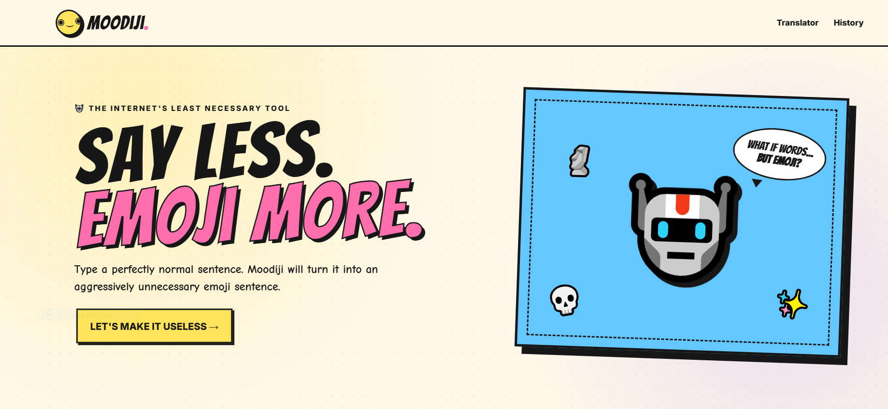
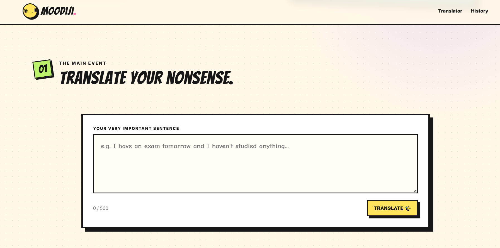
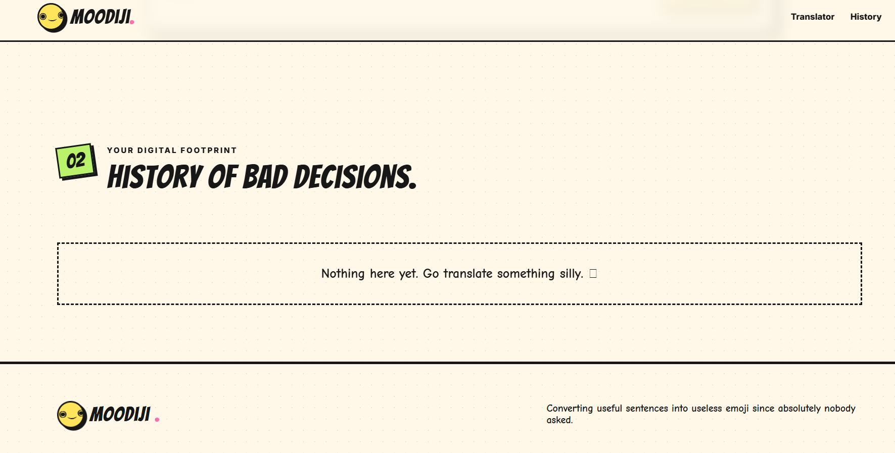
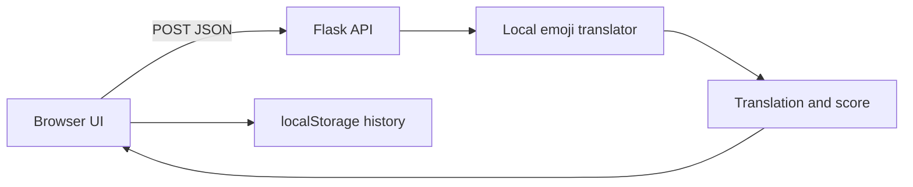

# Moodiji 🎯

Moodiji is a silly emoji translator that converts ordinary sentences into deliberately unnecessary emoji translations with a comic-book aesthetic. The current implementation runs locally using playful word and mood mappings, so it does not require an external AI service or API key.

## Basic Details

### Team Name
pookiees

### Team Members
- Team Lead: mydhili pb - Jain University
- Member: shreya - Jain University

### Project Description
Moodiji translates normal sentences into expressive, intentionally unhelpful emoji combinations. It is a playful project built for the TinkerHub Useless Projects event.

### The Problem (that doesn't exist)
People keep using useful words when completely unnecessary emoji chaos would do.

### The Solution (that nobody asked for)
Moodiji turns ordinary sentences into comic-book-style emoji translations, complete with mood mappings, regeneration, copy, browser history, and a deliberately useless score.

## Technical Details

### Technologies/Components Used
- Python
- Flask
- HTML, CSS, and JavaScript
- Browser `localStorage`

This is a software-only project; no hardware components are required.

## Implementation

### Installation
```bash
python -m venv .venv

# Windows PowerShell
.venv\Scripts\Activate.ps1

# macOS/Linux
source .venv/bin/activate

pip install -r requirements.txt
```

### Run
```bash
python app.py
```

Open http://127.0.0.1:5000 in a browser. The Flask development server must remain running while using the site.

## Features
- Converts sentences into expressive emoji combinations.
- Recognizes common moods, actions, and topics with emoji mappings.
- Adds playful punctuation and opposite emoji responses for selected words.
- Supports copy and regenerate actions.
- Stores up to 12 translations in browser `localStorage`.
- Calculates a deliberately meaningless uselessness score from 0 to 100.
- Provides a responsive comic-book-style interface.

## Project Documentation

### Screenshots

*The Moodiji landing page and comic-book-style hero section.*


*The sentence translator with its 500-character input limit.*


*The local history section for previously translated sentences.*

### Workflow

*The browser sends text to Flask, receives the translation and score, and stores history locally.*

## Project Demo

### Video
https://github.com/mydhilipb4-cell/moodiji/blob/main/Demo%20Video%20-%20Pookies%20-%20Useless%20Projects.mp4

### API
- `POST /translate` translates a sentence and returns `translation` and `score`.
- `POST /regenerate` creates another translation for the same sentence.

Both endpoints accept a JSON body with a `text` field. Empty input returns an HTTP 400 error.

Example request:

```bash
curl -X POST http://127.0.0.1:5000/translate \
	-H "Content-Type: application/json" \
	-d "{\"text\":\"I have an exam tomorrow\"}"
```

Example response:

```json
{
	"translation": "📝 ⏰",
	"score": 78
}
```

The score and unknown-word emoji can vary because the app uses randomness.

## Future Improvements
To connect a genuine AI provider, replace the local `translate()` function in `app.py` while keeping the existing `/translate` response format. An API key should be stored in an environment variable rather than committed to the repository.

## Team Contributions
- mydhili pb: Project concept, interface design, and implementation.
- shreya: Project development, testing, and documentation.

---
Made with ❤️ at TinkerHub Useless Projects


